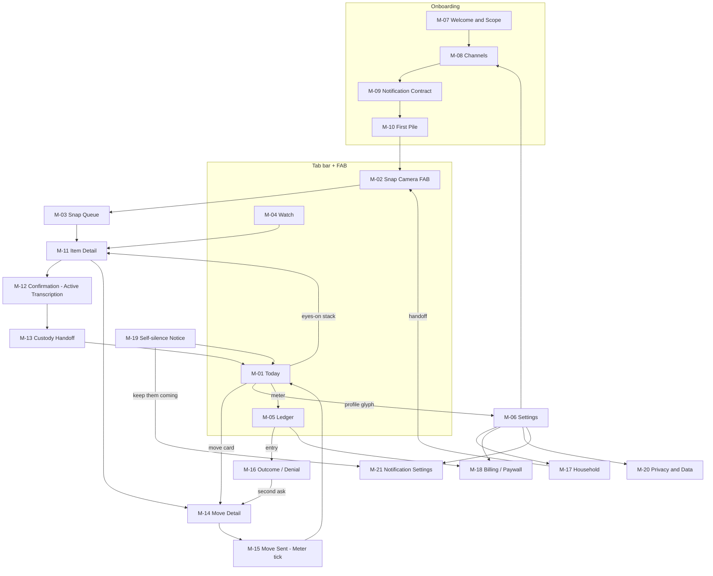
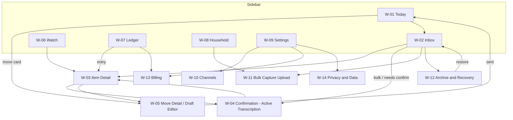

# Molehill — Pages, Flows, and States (Both Platforms)

**Version 1.0 · Derived from `product/brief.md` v1.1 and `product/object-model.md`. Screen IDs are stable — wireframes in `design/wireframes/` reference them and must never renumber.**

Navigation is locked by brief §8: **mobile** = 4 tabs + center Snap FAB (`Today · Snap · Watch · Ledger`, Settings via profile glyph on Today); **web** = left sidebar (`Today · Inbox · Watch · Ledger · Household · Settings`). Mobile is the capture-and-confirm surface; web is the power surface.

State vocabulary used for every screen: **empty · loading · ideal · partial · error · offline · degraded-AI**. Degraded-AI = the triage/drafting pipeline is down; per brief §9 everything deterministic (capture, countdowns, scheduler, Meter, Receipts, billing) keeps working and the UI says so plainly.

---

## Part 1 — Mobile screen inventory (M-xx)

### M-01 Today
- **Purpose:** The one Move + amnesty re-entry. The only screen a returning user ever lands on, whether away 1 day or 101 (Invariant I-14).
- **Key content:** Today's single Move card ("One move today: your parking ticket doubles $85 → $170 Friday"), current Tax Meter total, custody one-liner ("Watching 4 deadlines"), profile glyph → M-06. Deadline-critical Eyes On items stack above the Move card (cap-exempt). Never a backlog count, never "overdue."
- **Primary action:** open the Move (→ M-14). **Secondary:** "not this one" (decline, neutral), snooze to later this week, profile glyph, Meter tap → M-05.
- **States:**

| State | Shows |
|---|---|
| empty | "Nothing needs a move today. 4 deadlines under watch." + Meter total — calm, no fabricated urgency |
| loading | Meter numerals + skeleton Move card; cached last-known Meter shown immediately |
| ideal | One Move card with dollars-at-stake, Meter, custody line |
| partial | Move ready but an Extraction still unconfirmed → card reads "90 seconds to confirm the numbers first" → M-12 |
| error | "Couldn't reach Molehill — your deadlines are still being watched server-side." Retry button |
| offline | Cached Move + Meter, banner "Offline — confirmations will sync"; Snap still works |
| degraded-AI | Deterministic content intact (Meter, countdowns, custody). New captures queue: "Reading room is backed up; your snaps are safe and queued" |

### M-02 Snap Camera (center FAB)
- **Purpose:** Dumb-fast capture of paper, opened or unopened. Zero AI at capture time; must never lag or wait on a model.
- **Key content:** Full-bleed camera, shutter, batch counter chip, flash/torch, thumbnail of last capture, "pile mode" (rapid multi-shot).
- **Primary action:** shutter (repeatable). **Secondary:** review queue (→ M-03), import from photo library, cancel.
- **States:**

| State | Shows |
|---|---|
| empty | First use: one-line overlay "Point at the pile. Envelopes can stay closed." |
| loading | Camera warm-up < 300ms; shutter enabled the instant preview renders |
| ideal | Live viewfinder, batch count incrementing per shot |
| partial | Some shots too blurry to read later — capture still succeeds; quality flag surfaces in M-03, never blocks the shutter |
| error | Camera permission denied → inline fix path to OS settings + library-import fallback |
| offline | Identical to ideal; badge "will upload when back online" — capture is offline-safe by design |
| degraded-AI | Identical to ideal — capture has no AI dependency, ever |

### M-03 Snap Queue
- **Purpose:** Post-capture review: see what was captured, discard accidents, watch triage progress.
- **Key content:** Grid of captures with per-capture status (queued / uploading / reading / triaged → N Items), retake/discard, consent toggle "keep source image" (per-document, default off).
- **Primary action:** "Done — Molehill will take it from here." **Secondary:** discard capture (24h undo), retake, open resulting Item (→ M-11).
- **States:**

| State | Shows |
|---|---|
| empty | "No snaps waiting. The camera's one tap away." |
| loading | Upload progress per tile |
| ideal | Tiles resolving to "→ 2 items found" as triage completes |
| partial | Mixed: some triaged, some queued, one blurry ("couldn't read — retake or let it wait") |
| error | Upload failed tile with retry; capture never lost (on-device original) |
| offline | Tiles held at "queued — uploads when online" |
| degraded-AI | Tiles held at "safe and queued — reading room is catching up"; no countdown pressure |

### M-04 Watch
- **Purpose:** Custody list + Receipts: what Molehill is holding so the user doesn't have to.
- **Key content:** Active Watches ranked by dollars-at-stake, each with custody phrase, next deadline countdown (deterministic), critical badge for legal-floor items; Receipt counter header ("412 deadlines watched · 0 silently missed").
- **Primary action:** open a Watch's Item (→ M-11). **Secondary:** view Receipt detail/history, release custody (typed confirm if critical).
- **States:**

| State | Shows |
|---|---|
| empty | "Nothing under watch yet. Snap the pile and hand it over." + Receipt counter at 0/0 |
| loading | Receipt header instant (cached), skeleton list |
| ideal | Ranked custody list, live countdowns, Receipt header |
| partial | A Watch pending confirmation shows "custody starts after you confirm the date" → M-12 |
| error | Cached list + "showing last synced state; watching continues server-side" |
| offline | Cached countdowns keep ticking (client clock); sync badge |
| degraded-AI | Fully functional — Watchtower is deterministic by law |

### M-05 Ledger (Tax Meter)
- **Purpose:** The running refund: dollars averted + recovered, break-even honesty.
- **Key content:** Big Meter total, averted vs recovered split, entry list (each traceable to its Outcome and Item), break-even line ("Molehill has saved you $312 · cost you $27"), monthly money summary.
- **Primary action:** open a MeterEntry → its Outcome/Item (→ M-16/M-11). **Secondary:** billing (→ M-18), export ledger CSV (hands off to web for full export).
- **States:**

| State | Shows |
|---|---|
| empty | "$0 so far. The meter only moves on real money — first move usually lands in week one." Break-even line shows cost honestly even at $0 |
| loading | Cached total instantly; entries skeleton |
| ideal | Total, split, entries, honest break-even line (even when negative) |
| partial | Pending Outcome shown greyed "waiver sent — awaiting reply (typ. 14 days)" — never counted until real |
| error | Cached totals + retry; Meter is server-summed, never client-guessed |
| offline | Cached ledger, sync badge |
| degraded-AI | Fully functional — plain arithmetic, no AI (brief §9) |

### M-06 Settings
- **Purpose:** Hub: account, channels shortcut, notifications, privacy, billing, household, help.
- **Key content:** Profile, plan + billing state (incl. "auto-paused" if so), rows → M-08/M-17/M-18/M-20/M-21, scope statement ("Molehill never moves money and never auto-dismisses government or legal mail"), sign out.
- **Primary action:** navigate to subsections. **Secondary:** contact support, legal/policy links.
- **States:** empty n/a (always populated) · loading: cached profile · ideal: full hub · partial: a channel erroring shows a repair badge on its row · error: cached values read-only · offline: read-only with sync note · degraded-AI: unaffected.

### M-07 Onboarding — Welcome & Scope Promise
- **Purpose:** First screen ever. Sets identity (harm-reduction agent, not another todo app) and states the legal floor + scope prohibitions up front (Product Law #2 requires it in onboarding).
- **Key content:** One-liner ("Snap the scary envelope. Molehill reads it, finds the dollars, does 90% of the fixing."), three promises (never moves money · government/legal mail always gets your eyes · billing pauses itself when you don't use it), sign-in.
- **Primary action:** continue → M-08. **Secondary:** sign in to existing account, privacy policy.
- **States:** empty n/a · loading: static, instant · ideal: promise screen · partial n/a · error: auth failure inline retry · offline: "need a connection to set up" · degraded-AI: unaffected.

### M-08 Onboarding — Channels ("mail can find us")
- **Purpose:** Product Law #1: automatic ingestion offered in month one, at setup — Snap is a convenience, never the sole trigger.
- **Key content:** Four cards: forward-in email address (created instantly, copy button), USPS Informed Delivery connect (OAuth), Mailroom virtual address (opt-in, address shown on completion), Household invite (→ M-17). Skippable individually, "Snap-only for now" allowed but the cards return in Settings.
- **Primary action:** connect each channel. **Secondary:** skip for now → M-09.
- **States:** empty: all four unconnected (default) · loading: per-card verifying spinner · ideal: ≥1 auto channel green-checked · partial: USPS OAuth pending email verification ("verifying — works within a day") · error: per-card failure with retry, others unaffected · offline: cards disabled, "come back online to connect" · degraded-AI: unaffected (channel plumbing is deterministic).

### M-09 Onboarding — Notification Contract
- **Purpose:** Promise the ladder in advance (crown graft from ignition): what Molehill will send, when it escalates, when it shuts up.
- **Key content:** The contract, verbatim: "One notification a day at 9am, max. Deadline-critical: one escalation at 72h, one partner ping if you set one, then documented silence. Three ignores and I go quiet until your next snap." Quiet-hours picker, framing choice (gain default; loss-framed countdowns behind explicit opt-in toggle), push permission request.
- **Primary action:** accept contract + grant push. **Secondary:** adjust quiet hours, decline push (in-app + email fallback explained).
- **States:** empty n/a · loading n/a (static) · ideal: contract + toggles · partial: push declined → shows fallback plan without guilt · error: OS permission sheet failure, retry path · offline: preferences cached, sync later · degraded-AI: unaffected.

### M-10 Onboarding — First Pile
- **Purpose:** Convert the six-week pile in one session; land the first dollar find fast (thesis: first real win inside week 1).
- **Key content:** "Grab the pile. Don't open anything. Just point." → embeds M-02 in pile mode; live counter "9 snapped"; on finish, handover line: "That's my problem now. I'll have verdicts within the hour — first look tomorrow at 9am, or peek now."
- **Primary action:** start snapping (→ M-02). **Secondary:** "I don't have a pile" (skip to Today with channels active), peek at triage (→ M-03).
- **States:** empty: pre-snap coaching card · loading: n/a (camera) · ideal: counter + handover line · partial: some captures queued · error: inherited from M-02/M-03 · offline: capture works, "verdicts when back online" · degraded-AI: "snaps are safe; the reading room will catch up — I'll notify you" (sets expectation, no dead-end).

### M-11 Item Detail
- **Purpose:** Everything about one Item: what it is, what it costs, its Verdict, Extractions, Watch, Moves, history.
- **Key content:** Title + sender + plain-language consequence, Verdict chip (Nothing Needed / One Move / Eyes On), dollars-at-stake, confirmed Extractions with source-region thumbnails, Watch status + Deadlines, Move list with statuses, provenance ("Snapped by Sam, Tuesday" for Handoffs), archive.
- **Primary action:** contextual — confirm (→ M-12), open Move (→ M-14), or accept verdict. **Secondary:** override Verdict (one tap, never argued with), edit a confirmed value (re-transcription), release custody, archive, view source image (on-device or "deleted per your privacy settings").
- **States:**

| State | Shows |
|---|---|
| empty | n/a — an Item always has content by construction |
| loading | Title/verdict cached; extraction regions load progressively |
| ideal | Full dossier |
| partial | Unconfirmed Extractions flagged "needs your 90 seconds" with confirm CTA |
| error | Cached read-only + retry; no destructive actions offered |
| offline | Read-only cached; confirmation queues for sync |
| degraded-AI | Confirmed data fully shown; pending re-triage fields say "reading room catching up" |

### M-12 Confirmation (Active Transcription)
- **Purpose:** The anti-complacency gate (Product Law #3). User **types** each money/deadline value while looking at the highlighted source region. No approve-tap path exists for consequential fields.
- **Key content:** One field at a time: zoomed source-region crop (highlighted), typed input (date pad / currency pad), progress ("2 of 3"), match/mismatch resolution (typed value wins on mismatch), "not on the document" reject option, low-confidence fields prompt direct typing.
- **Primary action:** type value → next field → finish → custody ritual (M-13) or Move (M-14). **Secondary:** reject field, zoom source, "do this later" (Item stays `needs_confirmation`, no penalty).
- **States:**

| State | Shows |
|---|---|
| empty | n/a — screen only exists with pending fields |
| loading | Region crop loading; typing pad ready immediately |
| ideal | Crop + pad + progress; ~90-second total flow |
| partial | Mismatch state: "You typed Jan 24, I read Jan 21 — yours wins. Double-check the highlight?" |
| error | Save failure → typed values held locally, retry banner |
| offline | Full flow works against on-device image; syncs later (mobile snaps only; server-channel items need connectivity for the crop) |
| degraded-AI | Fully functional — confirmation of already-extracted fields needs no live model; brand-new items wait upstream |

### M-13 Custody Handoff (Watch ritual)
- **Purpose:** The explicit transfer of vigilance (crown graft from temporal): make the handoff felt, once, briefly.
- **Key content:** "This envelope is mine now — watching 3 deadlines." Deadline list with dates and dollars (all human-confirmed seconds ago), the promised ladder for this Watch, critical badge if legal-floor.
- **Primary action:** "It's yours" (activates Watch, writes toward Receipt). **Secondary:** review a deadline (back to M-12), decline custody ("I'll handle it myself" — recorded as released, never judged).
- **States:** empty n/a · loading: instant (data in hand) · ideal: ritual card · partial: n/a (gated on full confirmation) · error: activation retry, nothing lost · offline: queues activation, countdown starts from confirmed dates regardless · degraded-AI: unaffected (deterministic).

### M-14 Move Detail
- **Purpose:** Review the ~90%-done action; the human does the last 10%: read, optionally edit, and fire the send gate.
- **Key content:** The Draft (letter/email/script/checklist) with merge-locked values visually pinned to their confirmed Extractions, dollars-at-stake header, Playbook stat when n≥5 ("this issuer waives 72% of first asks"), execution channel (Molehill sends email/letter; call script shows number pre-dialed; return checklist shows nearest drop-off), edit affordance.
- **Primary action:** Send gate — "Send it" (explicit tap; for `user_manual` kinds: "I did it"). **Secondary:** edit draft, switch variant (pay walkthrough ↔ contest letter), decline ("not this one"), snooze.
- **States:**

| State | Shows |
|---|---|
| empty | n/a |
| loading | Header instant; draft body streams in from cache |
| ideal | Draft + locked values + send gate |
| partial | Draft ready but one value unconfirmed → send gate disabled, "confirm the amount first" → M-12 (Invariant I-10) |
| error | Send dispatch failed → "not sent — nothing went out. Retry?" (explicit about the failure state) |
| offline | Read/edit fine; send gate queues with clear "will send when online" consent |
| degraded-AI | Existing final Draft fully sendable; re-draft requests queue ("editing help is catching up — you can edit by hand") |

### M-15 Move Sent (Meter tick)
- **Purpose:** Close the loop with real-money feedback in ≤5 seconds; no confetti economy, just the number.
- **Key content:** "Sent. $85 doubling averted." Meter animates old → new total; what happens next ("typical reply: 14 days — I'll watch for it"); Receipt line if a Deadline was met.
- **Primary action:** done → Today. **Secondary:** view the sent Draft, open Ledger.
- **States:** empty n/a · loading: optimistic tick pending server ack, marked "confirming…" · ideal: tick + next-steps · partial: sent but Outcome pending → averted amount shown as "pending creditor reply" (not yet on Meter — the Meter never lies) · error: send actually failed → routes back to M-14 error state honestly · offline: for `user_manual` moves only; queues attestation · degraded-AI: unaffected.

### M-16 Outcome / Denial Detail (RSD-safe)
- **Purpose:** Deliver results — especially denials — neutrally, under the agent's identity (Product Law #6).
- **Key content:** For grants: "The issuer waived it. $35 back on your meter." For denials: "The issuer said no this time. Second asks succeed ~40% — want me to draft it?" Raw creditor reply behind an explicit "show original reply" tap (Invariant I-9). Next-Move offer.
- **Primary action:** accept second-ask draft (→ M-14) or acknowledge. **Secondary:** show original reply, mark handled elsewhere, dispute the recorded amount.
- **States:** empty n/a · loading: instant from notification payload · ideal: neutral relay + next step · partial: reply received but still neutralizing → "reply arrived; summarizing it for you" · error: retry fetch · offline: cached relay text · degraded-AI: deterministic facts shown ("reply arrived, marked denied"); neutral summary queues — raw text stays behind the tap, never auto-shown.

### M-17 Household
- **Purpose:** The consented dyad: Sam hands items to the agent; the agent carries the nag, never the spouse.
- **Key content:** Members + roles, invite flow, Handoff explainer ("snap it or say it — 'the forms are due Friday'"), Handoff quick-capture button, failover-ping toggle (opt-in escalation contact), privacy note (members see status-only for items they didn't capture — Invariant I-20).
- **Primary action:** invite member / make a Handoff (→ M-02 with handoff flag + note field). **Secondary:** toggle failover, remove member, leave household.
- **States:** empty: solo user → household-tier pitch + invite CTA · loading: member list skeleton · ideal: members + handoff activity (status-lines only) · partial: invite pending ("expires in 14 days") · error: invite send retry · offline: read-only · degraded-AI: handoff capture works; triage queues.

### M-18 Billing / Paywall
- **Purpose:** Honest money surface: plan, auto-pause state, the three anti-ADHD-tax commitments; the free-tier quota paywall.
- **Key content:** Current plan + price, billing state (incl. banner "Paused — you weren't charged this month" when auto-paused), commitments (auto-pause · one-tap cancel, no retention flow · free tier never auto-converts), per-recovery fee option (flat fees, never a %), quota meter on free tier ("4 of 5 items this month"), **one-tap cancel button flat on the page — no hunting, no flow**.
- **Primary action:** subscribe / resume (explicit tap only) / cancel (one tap, immediate). **Secondary:** switch pricing mode, restore purchases, invoices.
- **States:** empty n/a · loading: cached state · ideal: plan + commitments + cancel visible · partial: quota hit on free tier → paywall variant: "5 of 5 this month — items still captured and safe; they triage when the month rolls or you upgrade" (capture is never lost to the paywall) · error: store/processor failure, "nothing was charged" made explicit · offline: read-only, no purchase attempts · degraded-AI: unaffected.

### M-19 Self-silence Notice
- **Purpose:** Say the silence out loud (brief glossary): shown in-app after the third ignored notification, mirroring the one push it accompanies.
- **Key content:** "These aren't landing — I'll wait for your next snap. Your 3 watched deadlines stay watched; anything critical still gets through." What stays on (critical ladder, custody, Meter) vs. what goes quiet (daily nudges).
- **Primary action:** "Keep them coming" (resets streak, exits self-silence). **Secondary:** "Good, thanks" (accepts silence), adjust notification settings (→ M-21).
- **States:** empty n/a · loading n/a (payload in hand) · ideal: notice + choices · partial n/a · error: preference save retry · offline: choice cached, syncs · degraded-AI: unaffected (hard-coded policy).

### M-20 Privacy & Data
- **Purpose:** Product Law #4 made visible and operable.
- **Key content:** Plain-language policy (zero-retention/on-device images, never trained on, deletion schedule), per-document consent list (every doc with "keep image" on, revocable individually), export request (full JSON+CSV, delivered by email link, prepared server-side), delete account (7-day undo window explained).
- **Primary action:** export data / delete account (typed confirmation). **Secondary:** revoke image consents, open published deletion policy.
- **States:** empty: no consented images → "no source images are being kept" · loading: consent list skeleton · ideal: policy + controls · partial: export preparing ("we'll email the link — typically minutes") · error: request retry, idempotent · offline: read policy only; requests need connectivity · degraded-AI: unaffected.

### M-21 Notification Settings
- **Purpose:** Tune the contract without breaking its floors.
- **Key content:** The standing contract restated, quiet hours, framing toggle (gain default / loss-framed countdowns opt-in), channel per kind (push/SMS/email), outbound-dollar-event SMS toggle for dark periods, self-silence status + reset. Floors shown as non-editable: 1/day cap, critical-ladder exemption, no missed-loss quantification.
- **Primary action:** save changes. **Secondary:** send test notification, view ladder spec.
- **States:** empty n/a · loading: current prefs · ideal: toggles + floors · partial: SMS chosen but no verified phone → inline verify · error: save retry, last-good kept · offline: cached edit, syncs · degraded-AI: unaffected.

---

## Part 2 — Web screen inventory (W-xx)

### W-01 Today
- **Purpose:** Same single-Move contract as M-01 on the power surface; amnesty rules apply identically (the API enforces I-14, not the client).
- **Key content:** One Move card, Meter total, custody summary, critical Eyes On stack. No backlog on this screen even though Inbox exists one click away — Today never shames.
- **Primary action:** open Move (→ W-05). **Secondary:** decline/snooze, jump to Inbox/Watch/Ledger.
- **States:** empty: "Nothing needs a move today" + custody line · loading: cached Meter + skeleton card · ideal: Move + Meter · partial: unconfirmed-values card → W-04 · error: retry with "deadlines still watched" reassurance · offline: cached read-only banner · degraded-AI: deterministic content intact; queue notice for new captures.

### W-02 Inbox
- **Purpose:** All Items: the power surface for search, filter, and bulk action. This is where "7 of these 11 need nothing" happens at desk scale.
- **Key content:** Item table ranked by dollars-at-stake (age is a column, never a judgment), columns: sender, title, Verdict chip, dollars, custody, status; full-text search; filters (verdict class, legal floor, doc kind, channel, member, date range, needs-confirmation); bulk select with bulk actions (accept Nothing Needed verdicts, archive, request re-triage); link to Archive & Recovery (W-12).
- **Primary action:** open Item (→ W-03); bulk-accept Nothing Needed. **Secondary:** search/filter, bulk archive (undo toast, 30-day recovery), export current view CSV.
- **States:**

| State | Shows |
|---|---|
| empty | "No items yet — forward an email or snap the pile from your phone" + channel shortcuts |
| loading | Header counts instant, rows skeleton |
| ideal | Ranked table + filters |
| partial | Search/filter with zero hits: "nothing matches" + clear-filters; or some rows still `reading` with progress chips |
| error | Cached rows read-only + retry |
| offline | Cached list, actions disabled with explanation |
| degraded-AI | Existing rows fine; `reading` rows show "queued — reading room catching up"; bulk re-triage disabled |

### W-03 Item Detail (web)
- **Purpose:** Full dossier + audit trail; superset of M-11.
- **Key content:** Everything in M-11 plus: full history timeline (capture → triage → confirmations → moves → outcomes, timestamped), extraction table with confidence + confirm method, source document viewer (while retained; else deletion notice), Verdict history incl. overrides.
- **Primary action:** contextual (confirm → W-04, open Move → W-05). **Secondary:** override verdict, edit values (re-transcription), archive/delete, print/download item summary.
- **States:** empty n/a · loading: progressive dossier · ideal: dossier + timeline · partial: unconfirmed flags with CTA · error: read-only cached · offline: read-only · degraded-AI: confirmed data intact; pending fields labeled.

### W-04 Confirmation (Active Transcription, web)
- **Purpose:** Identical law to M-12 — typing required, no approve-tap. Bulk-friendly: fields queue across selected Items but each is still individually typed (Product Law #3 forbids batching the consent itself).
- **Key content:** Left: zoomed source region; right: typed field entry; queue rail of remaining fields across items; mismatch resolution identical to M-12.
- **Primary action:** type → next. **Secondary:** reject field, skip item, open full document.
- **States:** empty: "nothing awaiting confirmation" · loading: crop fetch · ideal: split view + queue rail · partial: mismatch banner (typed wins) · error: values held locally, retry · offline: unavailable for server-channel images ("reconnect to view source") · degraded-AI: fully functional.

### W-05 Move Detail / Draft Editor (web)
- **Purpose:** M-14 with a real editor: revise the Draft with tracked versions; merge-locked values remain uneditable inline (edit → re-transcription).
- **Key content:** Draft editor (versions, restore), locked merge chips with hover→source region, Playbook panel (grant rate, median response, second-ask rate when n≥5), execution channel selector, send gate.
- **Primary action:** Send it (explicit gate). **Secondary:** edit, switch variant, decline, snooze, download PDF of letter.
- **States:** empty n/a · loading: draft streams from store · ideal: editor + playbook + gate · partial: unconfirmed value → gate disabled with reason (I-10) · error: dispatch failure — "nothing went out" + retry · offline: edit locally, gate disabled · degraded-AI: hand-editing + sending existing final drafts works; AI revise queues.

### W-06 Watch (web)
- **Purpose:** Custody at desk scale: calendar + list of every Deadline, Receipt ledger in full.
- **Key content:** Month calendar of Deadlines (colored by criticality), custody list, per-Watch ladder plan viewer ("what I promised to send and when"), Receipt ledger table (every terminal deadline, disposition, ladder_completed), the headline counter.
- **Primary action:** open Item from a Deadline. **Secondary:** release custody, export Receipt ledger, print month view.
- **States:** empty: "no deadlines under watch" + capture prompts · loading: counter instant, calendar skeleton · ideal: calendar + list + receipts · partial: pending-confirmation watches sidebar · error: cached read-only · offline: cached; countdowns tick client-side · degraded-AI: fully functional (deterministic module).

### W-07 Ledger (web)
- **Purpose:** M-05 plus analysis: the money story over time.
- **Key content:** Meter total + averted/recovered split, monthly chart, entries table (traceable Outcome links, reversals visible), break-even line vs. subscription paid, per-creditor recovery table, CSV export.
- **Primary action:** open entry → Outcome/Item. **Secondary:** export CSV, change date range, open Billing (W-13).
- **States:** empty: "$0 — the meter only moves on real money" + honest cost line · loading: totals instant, chart skeleton · ideal: full ledger · partial: pending outcomes greyed, uncounted · error: cached totals · offline: cached · degraded-AI: fully functional.

### W-08 Household (web)
- **Purpose:** M-17 at desk scale + administration.
- **Key content:** Members, roles, invites, per-member handoff activity (status-lines only for non-captured items — I-20), failover configuration, household-plan management.
- **Primary action:** invite / manage members. **Secondary:** toggle failover, transfer ownership, disband (typed confirm).
- **States:** empty: pitch + invite · loading: skeleton · ideal: roster + activity · partial: pending invites · error: retry · offline: read-only · degraded-AI: unaffected.

### W-09 Settings (web)
- **Purpose:** Hub mirroring M-06 with web-only depth (sessions, connected devices).
- **Key content:** Profile, notification contract (edit → same floors as M-21), channels (→ W-10), privacy (→ W-14), billing (→ W-13), sessions/devices, danger zone.
- **Primary/secondary:** navigate; save per-section.
- **States:** as M-06 (empty n/a · cached loading · ideal hub · partial repair badges · error read-only · offline read-only · degraded-AI unaffected).

### W-10 Channels (web)
- **Purpose:** Full management of the automatic-ingestion promise: the loop must restart with zero sustained user behavior.
- **Key content:** Channel cards with live status (active/verifying/erroring/paused), forward-in address + copy, USPS Informed Delivery connect/repair, Mailroom address + scan activity, Handoff channel status, per-channel ingestion history (counts, last received).
- **Primary action:** connect/repair a channel. **Secondary:** pause channel, disconnect (burns address), test-send.
- **States:** empty: nothing connected → setup wizard · loading: status polling · ideal: green cards + activity · partial: one card erroring (repair CTA) while others run · error: status fetch retry · offline: read-only · degraded-AI: unaffected (ingestion queues downstream).

### W-11 Bulk Capture Upload
- **Purpose:** Power capture: drag a folder of scans/PDFs/photos; the web half of pile amnesty.
- **Key content:** Dropzone, per-file upload + triage progress, per-document consent toggle, resulting Items list as triage completes, duplicate detection notice.
- **Primary action:** upload. **Secondary:** remove file pre-processing, open resulting Items, cancel batch.
- **States:** empty: dropzone + formats note · loading: per-file progress · ideal: files → "N items found" · partial: some processed, some queued, unsupported-file rows flagged · error: per-file retry, batch never all-or-nothing · offline: unavailable ("uploads need a connection") · degraded-AI: uploads accepted and held safe; triage queued with honest ETA.

### W-12 Archive & Recovery
- **Purpose:** The undo surface: archived and deleted Items, restore within the 30-day window.
- **Key content:** Two tabs (Archived / Deleted), each searchable; deleted rows show days-remaining until purge; restore and permanent-delete (typed confirm); note that purge honors the published deletion policy.
- **Primary action:** restore. **Secondary:** permanent delete now, search, empty-trash (typed confirm).
- **States:** empty: "nothing archived — items archive themselves 14 days after they're resolved" · loading: skeleton · ideal: lists + countdown chips · partial: search zero-hits · error: cached read-only · offline: read-only · degraded-AI: unaffected.

### W-13 Billing (web)
- **Purpose:** M-18's full console: invoices, pricing-mode switch, pause history.
- **Key content:** Plan + state (auto-pause banner when applicable: "September: not charged — you didn't use Molehill"), commitments block, pricing mode (subscription / per-recovery / hybrid) with flat fee table, invoice history, quota view on free tier, one-tap cancel flat on the page.
- **Primary action:** subscribe/resume/cancel. **Secondary:** switch pricing mode, download invoices, update payment method (hosted processor page — Molehill never sees the instrument).
- **States:** empty n/a · loading: cached state · ideal: console · partial: quota-hit paywall variant (captures stay safe) · error: "nothing was charged" made explicit + retry · offline: read-only · degraded-AI: unaffected.

### W-14 Privacy & Data (web)
- **Purpose:** M-20's full console; the export/delete surface of record (brief §8 assigns data export/delete to web).
- **Key content:** Policy in plain language, per-document consent manager (thumbnail-free list: sender/date only), export builder (full account JSON + CSVs; images only where consent-retained), delete account with 7-day-undo explanation, breach-notification commitment.
- **Primary action:** export / delete (typed confirmation). **Secondary:** revoke consents individually or all, view deletion-schedule table (matches object-model retention rows).
- **States:** empty: "no source images retained" · loading: consent list · ideal: full console · partial: export job running with progress · error: idempotent retry · offline: unavailable for requests · degraded-AI: unaffected.

---

## Part 3 — End-to-end workflows

Numbered steps reference screen IDs. Actors: **U** = user (Maya), **P** = partner (Sam), **S** = deterministic scheduler/system, **AI** = triage/drafting pipeline.

### F-01 First-run onboarding + first pile capture
1. U installs, opens app → **M-07** Welcome & Scope Promise; reads the three promises; continues.
2. **M-08** Channels: U copies her forward-in address into her email as a contact; connects USPS Informed Delivery (OAuth); skips Mailroom for now. At least the loop can now restart without her.
3. **M-09** Notification Contract: U accepts the ladder promise, sets quiet hours 22:00–08:00, leaves framing = gain, grants push.
4. **M-10** First Pile: "Don't open anything. Just point." → **M-02** pile mode; U snaps the six-week pile: 11 captures, 40 seconds.
5. **M-03** Snap Queue: tiles resolve as AI triages async: 11 captures → 11 Items.
6. S computes verdicts through the legal-floor gate: 7 **Nothing Needed** (all commercial), 3 **One Move**, 1 **Eyes On** (IRS letter — stamped by rule, not model).
7. U peeks: batch-accept screen for the 7 Nothing Needed items — "7 of these 11 require nothing from you." The product moment.
8. Highest-dollar Item (parking ticket, $85 → $170) → **M-12**: U types "Jan 24" and "85.00" from the highlighted regions. ~90 seconds.
9. **M-13** Custody Handoff: "This envelope is mine now — watching 2 deadlines." U taps "It's yours." Watch active; Receipt counter now live.
10. Today (**M-01**) shows: "First move ready tomorrow 9am — or do it now." Meter reads $0 with honest cost line. Onboarding complete; kill-test telemetry (week-1 capture) starts counting.

### F-02 Daily One Move (notification → confirm → sent → Meter tick)
1. S, 9:00 local: picks the single highest dollars-at-stake `ready` Move; sends the one `daily_move` push: "One move today: ticket doubles $85 → $170 Friday."
2. U taps push → **M-01** → Move card → **M-14** Move Detail: pre-written contest letter, values pinned to confirmed Extractions, Playbook line "this authority waives 61% of first asks."
3. U skims, taps the send gate ("Send it").
4. S dispatches (email channel) → `executing → executed`; **M-15**: "Sent. $85 doubling averted — pending their reply." Meter shows pending (not counted yet — the Meter never lies).
5. Deadline `met` → Receipt entry written; **M-04** counter increments: "…watched · 0 silently missed."
6. Days later the authority's reply arrives via forward-in (F-07 if denied). On grant: Outcome `granted` → MeterEntry `averted $85` → Ledger **M-05** ticks; weekly money summary includes it. Nothing else was asked of U today.

### F-03 Eyes-On legal item flow
1. Mailroom scans an envelope from the county court → Capture → AI triage extracts fields, but `legal_class = court` → S stamps Verdict **Eyes On** by rule (model never consulted on class; I-4).
2. Because Eyes On is cap-exempt (I-5), S notifies immediately, outside the daily cap, gain-framed and calm: "A court notice arrived. I've read it — you should see it. 2 minutes."
3. U → **M-11**: plain-language explanation ("jury summons; response due Feb 12; no dollars at stake; ignoring risks a bench warrant — here's exactly what's needed").
4. **M-12**: U actively transcribes the response date from the highlighted region.
5. **M-13**: custody ritual — Watch flagged deadline-critical; ladder promised: T-7 nudge, T-72h escalation, partner failover (Sam is configured), then documented silence.
6. Move = response walkthrough (`user_manual`) → **M-14**; U completes the county's own web form via the walkthrough, taps "I did it."
7. Deadline `met`, Receipt written. If U had gone dark, the full ladder would have fired regardless of self-silence — legal floor is exempt (I-5), and a missed deadline would read `missed_documented` with `ladder_completed = true`, never silent.

### F-04 Active-transcription confirmation flow (the gate itself)
1. Entry: any Item in `needs_confirmation` with consequential fields → **M-12** (or **W-04**).
2. Screen shows field 1 of N: zoomed highlighted source region + typing pad. No approve button exists on this screen.
3. U types the value she reads. Match with `value_ai` → `confirmed`, `confirm_method = active_transcription`.
4. Mismatch path: "You typed Jan 24, I read Jan 21 — yours wins. Double-check the highlight?" U re-reads, keeps hers → `corrected`; telemetry logs the model miss (aggregate only).
5. Low-confidence path: field arrives as "couldn't read this — please type it from the highlight" → same typed entry.
6. All consequential fields done → downstream unlocks in one transaction: Deadlines materialize from confirmed values only (I-3), Draft merge slots lock (I-1), Move may reach `ready` (I-10).
7. From here: deadline-bearing → **M-13** ritual; action-only → **M-14**. Later human edits re-enter this exact flow; AI can never touch the values again.

### F-05 Lapse → self-silence → scary-envelope reactivation (Pile Amnesty)
1. U goes dark. Day 1–3: two `daily_move` notifications ignored (streak 1, 2).
2. Third ignore → streak 3 → S sends the single `self_silence_notice`: "These aren't landing — I'll wait for your next snap. Your 3 deadlines stay watched." `notify_state = self_silenced`; daily nudges suppressed. **M-19** mirrors the notice in-app.
3. Weeks pass in silence. Watchtower keeps running: a deadline-critical ladder fires anyway (exempt), everything else stays quiet. BillingState: a full cycle with no activity → `auto_paused`; "You didn't use Molehill this month, so we didn't charge you" (also functions as the F-08 pause notice).
4. Reactivation from the outside — either: (a) the world sends a scary envelope and Informed Delivery/Mailroom sees it → S goes outbound with one `outbound_dollar_event` SMS: "Your ticket doubles Friday: $85 → $170. One tap to see the fix." — or (b) U snaps something on her own.
5. Any capture/open resets `notify_state = normal`, streak 0, User `lapsed → active`.
6. U opens the app → **M-01** in amnesty form, API-enforced (I-14): exactly one screen — "Welcome back. One move today, worth $170." Current Meter total. **No backlog, no count of missed items, no red anything.**
7. If she resumes billing (**M-18**, one explicit tap) paid features continue; either way the one Move is ready. Day 101 behaves like day 2. Reactivation-per-envelope-event metric increments (Product Law #8).

### F-06 Household Handoff
1. Sam (P), household member, is handed school forms by the fridge. Instead of nagging Maya: **M-17** → Handoff → **M-02** with handoff flag; snaps the forms; adds the note "due Friday."
2. Capture records `captured_by_user_id = Sam`; triage runs; the note seeds `source_meta`.
3. Item appears account-wide; Sam sees full content (he captured it — I-20); it enters Maya's normal flow.
4. Maya gets it as her One Move (or immediately if ≤72h → deadline-critical): "Sam handed me the school forms — due Friday, 5 minutes." **The agent carries the nag; Sam is never the messenger.**
5. Maya confirms (**M-12**), custody ritual (**M-13**), completes the checklist Move (**M-14** → "I did it").
6. Sam's Household view (**M-17**/**W-08**) shows only the status line: "Handled ✓." No content of Maya's other items is ever visible to him.
7. If Maya goes dark and the forms' Deadline hits T-24h with failover enabled: one `partner_failover` ping to Sam — the pre-promised single escalation from the ladder contract, never a stream.

### F-07 Denial arrival (RSD-safe)
1. Creditor replies "request denied" to the waiver letter via the forward-in thread → ingested as a Capture, matched to the open Move.
2. AI classifies + neutralizes; Outcome `denied`, `relay_state = pending_neutralization → relayed`. The raw letter is never pushed (I-9).
3. S sends one neutral, agent-identity notification (respects cap and quiet hours; framing = gain): "Quick update on the Chase waiver — they said no this time. Second asks succeed ~40%. Want me to draft it?" No exclamation, no commiseration theater, no "unfortunately."
4. U → **M-16**: same neutral relay; "show original reply" available behind an explicit tap; second-ask offer with the Playbook base rate.
5. U taps yes → `second_ask` Move drafts → **M-14** → send gate → sent. The denial becomes the setup for the next move, not a wound.
6. No MeterEntry is written for a denial (nothing recovered, nothing falsely averted); Playbook counters update (`n_denied`, feeding honest future base rates). If the second ask is granted: Outcome `granted` → MeterEntry → Meter tick.

### F-08 Billing auto-pause and return
1. S monthly job: Account had zero qualifying activity (no open, no Capture) for the full cycle → `subscribed → auto_paused`. The upcoming charge is **skipped**, not queued.
2. One `billing_pause_notice` (cap-exempt, quiet-hours-respecting): "You didn't use Molehill this month, so we didn't charge you. Your 3 deadlines stay watched." Custody never lapses with billing (object-model §18).
3. Months may pass; no charges accrue; no win-back emails, ever.
4. U returns (any path — often F-05's scary envelope). **M-01** works normally on amnesty rules; paid-only surfaces show a calm banner: "Billing is paused. Resume for $9/mo — or keep the free tier."
5. Resume requires an explicit tap on **M-18/W-13** → `auto_paused → subscribed`, cycle re-anchors today. Silent resume-and-charge does not exist (I-12).
6. Alternative: U cancels — one tap on the same screen, zero retention flow, effective immediately, pro-rata refund on annual → `cancelled → free`; data intact under free-tier limits.

### F-09 Item archive + recovery/undo
1. Resolved Items self-archive after 14 days (S job) — the Inbox stays a working set, not a museum.
2. Manual: U archives any Item from **M-11**/**W-02** (incl. bulk) → undo toast (10s) → archived. Guard: an Item with an active deadline-critical Watch requires explicit custody release with typed confirmation first (I-5).
3. U deletes an archived Item (**W-12** or M-11 overflow) → `deleted`, 30-day recovery window starts; row shows days-remaining.
4. Recovery: **W-12** → Deleted tab → restore → Item returns to `archived` with all children (Extractions, Moves, Outcomes) intact; Receipt history was never touched.
5. Day 30 → purge job: Item + document-derived text hard-deleted per the retention table; Receipt rows keep counters with nulled refs; MeterEntries survive (amounts only — the Meter never un-earns).
6. Immediate option: "delete now" with typed confirmation skips the window (honors the published deletion policy's on-demand clause).

### F-10 Data export / delete
1. U → **M-20** (mobile initiates) or **W-14** (surface of record).
2. Export: request → S builds the bundle server-side (account JSON: Items, Extractions with confirm provenance, Moves/Drafts, Outcomes, Watch/Deadline/Receipt history, Meter CSV, Notification log; images only where per-document consent retained them) → email with expiring signed link → **M-20/W-14** shows "export ready."
3. Consent revocation: per-document "keep image" toggles off → source images hard-deleted within 24h; Extraction text stands (human-confirmed, trustworthy without the image).
4. Delete account: typed confirmation ("delete my account") → `deletion_pending`, 7-day undo; confirmation email sent; app shows countdown banner with one-tap cancel of the deletion.
5. During the window: sign-in works only to cancel deletion or re-export.
6. Day 7 → purge: all objects hard-deleted per object-model retention rows; survivors are processor-held billing records (legal) and PII-free Playbook aggregates (I-15). Deletion-complete email sent. Published deletion policy matches this flow verbatim — Product Law #4.

---

## Part 4 — Navigation maps

### Mobile

(M-19 is reached from the self-silence push or an in-app banner on M-01, not from the tab bar.)

### Web

---

*Any screen or flow added later gets the next free ID in its series and a `BUILD_LOG.md` entry; existing IDs never renumber.*
