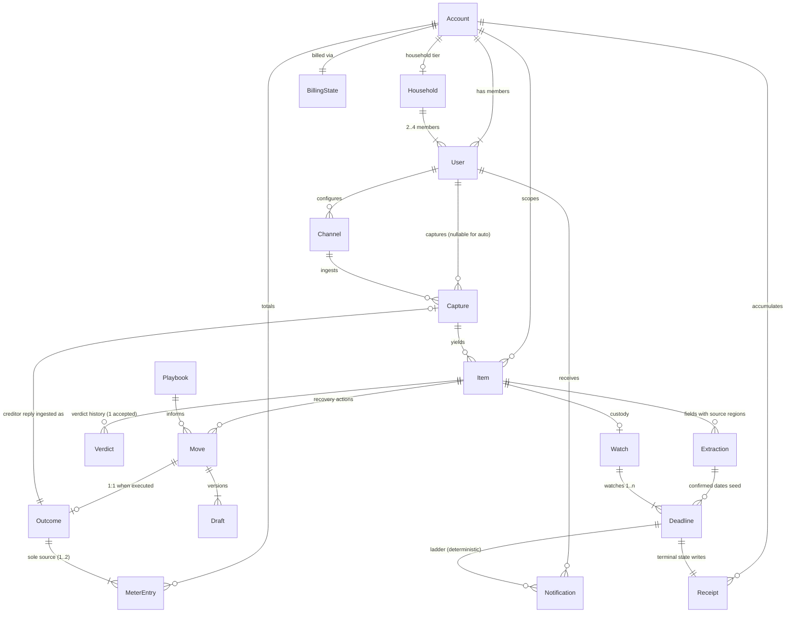

# Molehill — Canonical Object Model

**Version 1.0 · Derived from `product/brief.md` v1.1 (single source of truth). Terminology is the brief's glossary, used exactly. Changes require a `BUILD_LOG.md` entry.**

This document defines every persistent object in Molehill: 16 module-owned objects from the brief's §5 module table, plus **User** and **Account**. For each object: fields, relationships (with cardinality), owning module, full lifecycle state machine, and retention/deletion rules honoring Product Law #4 (privacy). Cross-object invariants are at the end and are binding on every implementation.

Conventions:

- IDs are prefixed ULIDs (`usr_`, `acc_`, `hh_`, `chn_`, `cap_`, `itm_`, `ext_`, `vrd_`, `mov_`, `drf_`, `pbk_`, `out_`, `wch_`, `ddl_`, `ntf_`, `rcp_`, `mtr_`, `bil_`). Sortable by creation time.
- All timestamps are UTC `timestamptz`; user-facing rendering uses `User.timezone`.
- `money` type = integer cents + ISO currency code (launch: USD only). Never floats.
- Soft-delete everywhere a "recovery/undo" surface exists (`deleted_at` + purge job); hard delete on the schedule in each object's retention row.
- **Schema-level prohibition (Product Law #10):** no table in this model may contain payment-card numbers, bank credentials, ACH details, or any field capable of moving money. `BillingState` holds only a tokenized reference to the external subscription processor (Apple/Stripe), never an instrument.

---

## 1. Account

**Owning module:** cross-cutting (platform). The billing/tenancy container. One Account per subscription; the Household tier attaches multiple Users to one Account.

| Field | Type | Constraints |
|---|---|---|
| `id` | ulid `acc_` | PK |
| `plan` | enum | `free` \| `solo` \| `household` |
| `pricing_mode` | enum | `subscription` \| `per_recovery` \| `hybrid` — Product Law #5 |
| `item_quota_month` | int | `free` = 5; paid = null (unlimited) |
| `items_used_this_cycle` | int | deterministic counter, resets on cycle boundary |
| `owner_user_id` | fk → User | not null; must be a member |
| `country` | ISO-3166 | launch: `US` |
| `created_at` / `deleted_at` | timestamptz | — |

**Relationships:** 1 Account → 1..n User; 1 Account → 0..1 Household; 1 Account → exactly 1 BillingState; 1 Account → 0..n Item, MeterEntry, Receipt (all account-scoped).

**Lifecycle:**
`created → active → deletion_pending → purged`

| From → To | Trigger |
|---|---|
| created → active | first User completes onboarding screen M-07 |
| active → deletion_pending | owner requests account deletion (M-20 / W-14); 7-day undo window |
| deletion_pending → active | owner cancels deletion within 7 days |
| deletion_pending → purged | automatic job at day 7; irreversible |

**Retention:** on purge, every child object is hard-deleted per its own row below; the only survivors are (a) legally required billing records at the payment processor (not in our DB) and (b) Playbook aggregates, which contain no PII by Invariant I-15. Published deletion policy states this verbatim.

---

## 2. User

**Owning module:** cross-cutting (platform). A person: Maya (primary) or Sam (household member).

| Field | Type | Constraints |
|---|---|---|
| `id` | ulid `usr_` | PK |
| `account_id` | fk → Account | not null |
| `email` | citext | unique, verified |
| `phone` | E.164 | nullable; required for SMS outbound channel |
| `display_name` | text | ≤ 60 chars |
| `household_role` | enum | `primary` \| `member` \| null |
| `timezone` | IANA tz | not null; drives the 9am scheduler |
| `quiet_hours` | int4range | default 21:00–08:00 local |
| `framing_pref` | enum | `gain` (default) \| `loss_optin` — Product Law #6; loss framing requires explicit opt-in event logged |
| `notify_state` | enum | `normal` \| `self_silenced` — see Notification lifecycle |
| `ignored_streak` | int | consecutive ignored non-critical Notifications; drives self-silence at 3 |
| `escalation_contact_user_id` | fk → User | nullable; the optional household failover ping target |
| `last_capture_at` / `last_open_at` | timestamptz | drive lapse detection + billing auto-pause |
| `onboarding_state` | enum | `new` \| `channels_done` \| `contract_done` \| `complete` |
| `created_at` / `deleted_at` | timestamptz | — |

**Relationships:** n User → 1 Account; 1 User → 0..n Channel, Capture, Notification. User never owns Items directly — Items are account-scoped with a `captured_by_user_id` provenance field, which is what makes Handoff work.

**Lifecycle:**
`invited → active → lapsed → active | deletion_pending → purged`

| From → To | Trigger |
|---|---|
| invited → active | invite accepted (Household member) or self-signup verified |
| active → lapsed | deterministic job: no `last_open_at` and no Capture for 21 days. Purely internal flag — **never shown to the user** (no "overdue", no guilt) |
| lapsed → active | any open, Snap, or ingestion-triggered confirmation. Re-entry is governed by Pile Amnesty (Invariant I-14) |
| active/lapsed → deletion_pending → purged | same 7-day pattern as Account |

**Retention:** on purge, PII is hard-deleted; Receipts and MeterEntries owned by the account survive only until account purge. `email` is tombstoned (hashed) for 90 days solely to prevent accidental re-invite loops, then dropped.

---

## 3. Capture

**Owning module:** Capture. One raw ingestion event, before triage. A Capture may yield 0..n Items (one photo of a pile → several Items; one email → usually one).

| Field | Type | Constraints |
|---|---|---|
| `id` | ulid `cap_` | PK |
| `account_id` | fk → Account | not null |
| `channel_id` | fk → Channel | not null |
| `captured_by_user_id` | fk → User | nullable (automatic channels: null) |
| `kind` | enum | `snap` \| `email_forward` \| `informed_delivery` \| `mailroom_scan` \| `handoff` \| `bulk_upload` |
| `media_refs` | jsonb[] | pointers: `{location: on_device \| processing_bucket, key, sha256, page_count}` — never inline bytes |
| `source_meta` | jsonb | envelope-window text, email headers, USPS metadata, Handoff note ("the forms are due Friday") |
| `consent_retain_image` | bool | default **false**; per-document consent, Product Law #4 |
| `status` | enum | see lifecycle |
| `failure_reason` | text | nullable |
| `created_at` / `purged_media_at` | timestamptz | — |

**Relationships:** n Capture → 1 Channel; 1 Capture → 0..n Item. Handoff captures also record `captured_by_user_id` = the household member, which drives the "agent carries the nag" flow.

**Lifecycle:**
`queued → uploading → received → triaging → triaged | discarded | failed`

| From → To | Trigger |
|---|---|
| queued | Snap taken offline, or email/USPS/Mailroom payload accepted at edge. Capture is dumb-fast: zero AI before this point |
| queued → uploading | device connectivity (mobile) / immediate (server channels) |
| uploading → received | media persisted to the encrypted processing bucket (or registered on-device for on-device-processing mode) |
| received → triaging | Triage worker picks up (async, never blocks the camera) |
| triaging → triaged | Triage produced ≥1 Item, or an explicit zero-Item result (blank page, duplicate) |
| triaging → failed | model/pipeline error after 3 retries; user sees the degraded-AI state, Capture is preserved and re-queued when the pipeline recovers |
| received/queued → discarded | user deletes an un-triaged capture from the Snap queue (M-03); 24h undo, then media purge |

**Retention (Product Law #4 — this is the load-bearing privacy row):**
- **Mobile Snap:** original image stays **on-device** in the app sandbox. The server-side copy used for extraction is hard-deleted within **24 hours of `triaged`**; confirmation UI renders source regions against the on-device original.
- **Server-side channels (email, Mailroom, Informed Delivery, web bulk upload):** image/PDF held encrypted in the processing bucket only until every consequential Extraction on its Items is confirmed or the Item archives — hard cap **30 days** — then hard-deleted, unless `consent_retain_image = true` for that specific document.
- **Never** used for model training. No exceptions, no aggregate carve-out.
- `media_refs` keys are wiped at purge; `source_meta` text (non-image) follows the Item's retention.

---

## 4. Channel

**Owning module:** Capture. A configured ingestion pathway for a user/account.

| Field | Type | Constraints |
|---|---|---|
| `id` | ulid `chn_` | PK |
| `account_id` | fk → Account | not null |
| `user_id` | fk → User | not null (owner of the pathway) |
| `kind` | enum | `snap` \| `email_forward` \| `informed_delivery` \| `mailroom` \| `handoff` |
| `address` | text | the `pile-x7f2@in.molehill.com` forward-in address, or Mailroom street address; null for `snap`/`handoff` |
| `external_ref` | jsonb | USPS Informed Delivery link token; Mailroom vendor account id |
| `status` | enum | see lifecycle |
| `error_detail` | text | nullable |
| `created_at` / `disconnected_at` | timestamptz | — |

**Relationships:** n Channel → 1 User; 1 Channel → 0..n Capture. `snap` and `handoff` channels are auto-created at onboarding; the other three are opt-in (but offered in month one — Product Law #1).

**Lifecycle:**
`created → verifying → active → paused | erroring → active | disconnected → deleted`

| From → To | Trigger |
|---|---|
| created → verifying | user initiates setup (M-08 / W-10): confirmation email sent, USPS OAuth started, Mailroom address provisioned |
| verifying → active | verification completes (link clicked, OAuth granted, first Mailroom scan received) |
| active → paused | user pause toggle; ingestion buffered at edge for 7 days, then bounced with a polite auto-reply |
| active → erroring | upstream failure (USPS token expired, mail bounce); one Notification of kind `channel_error`, exempt from nothing else — it respects the daily cap |
| erroring → active | re-auth / retry succeeds |
| any → disconnected | user disconnects; address is burned (never reissued to another account) |
| disconnected → deleted | 30 days later, hard delete |

**Retention:** channel config is PII-light; hard-deleted 30 days after disconnect or at account purge. Inbound raw emails at the edge (pre-Capture) are deleted immediately after Capture creation or bounce — the mail server retains nothing.

---

## 5. Household

**Owning module:** Capture. The consented dyad (or small group) that makes Handoff work: Sam hands items to the agent, the agent carries the nag.

| Field | Type | Constraints |
|---|---|---|
| `id` | ulid `hh_` | PK |
| `account_id` | fk → Account | unique — one Household per Account |
| `name` | text | default "Household" |
| `members` | — | via User.household_role; max 4 members at launch |
| `pending_invites` | jsonb[] | `{email, invited_by, expires_at}`; invites expire in 14 days |
| `failover_enabled` | bool | default false — the opt-in partner failover ping (crown graft from ignition) |
| `created_at` / `archived_at` | timestamptz | — |

**Relationships:** 1 Household → 1 Account; 1 Household → 2..4 User.

**Lifecycle:**
`created → inviting → active → archived`

| From → To | Trigger |
|---|---|
| created | account upgrades to `household` plan (M-17 / W-08) |
| created → inviting | first invite sent |
| inviting → active | ≥1 invite accepted |
| active → archived | plan downgrade or all members but owner leave; Handoff channel disables; existing Items keep provenance |

**Retention:** archived Households are hard-deleted after 90 days. **Privacy inside the household (Invariant I-20):** a member sees full content only for Items they captured; all other Items expose status-line only ("1 item in custody, deadline watched") unless the item's confirming user explicitly shares it. Molehill never becomes the surveillance tool for the partner.

---

## 6. Item

**Owning module:** Triage. One captured document/email/handoff after triage. **Never called "task" or "todo" anywhere — code, copy, or analytics.**

| Field | Type | Constraints |
|---|---|---|
| `id` | ulid `itm_` | PK |
| `account_id` | fk → Account | not null |
| `capture_id` | fk → Capture | not null |
| `captured_by_user_id` | fk → User | provenance (Handoff) |
| `sender_name` | text | AI-extracted, human-visible |
| `doc_kind` | enum | `bill` \| `fine` \| `notice` \| `subscription` \| `return` \| `refund_owed` \| `statement` \| `marketing` \| `personal` \| `other` |
| `legal_class` | enum | `commercial` \| `government` \| `tax` \| `court` \| `legal` \| `insurance_eob` \| `debt_collection` \| `unknown` — set by a **deterministic classifier-of-last-resort over AI output**: if AI is uncertain, `unknown`, and `unknown` is treated as legal-floor (Product Law #2, fail-closed) |
| `is_legal_floor` | bool generated | true iff `legal_class` ∉ {`commercial`} — includes `unknown` |
| `title` | text | plain-language, AI-written once, human-editable |
| `dollars_at_stake` | money | **deterministic denormalization** from confirmed Extractions + Deadline escalation math; the ranking key. Null until confirmation |
| `status` | enum | see lifecycle |
| `created_at` / `resolved_at` / `archived_at` / `deleted_at` | timestamptz | — |

**Relationships:** n Item → 1 Capture; 1 Item → 0..n Extraction; 1 Item → 0..1 current Verdict (1..n historical); 1 Item → 0..n Move; 1 Item → 0..1 Watch. Ranking rule: Items order by `dollars_at_stake` descending, **never** by age or "overdueness" (Invariant I-13).

**Lifecycle:**
`reading → needs_confirmation → verdict_nothing_needed | in_custody | move_ready → resolved → archived → deleted (recoverable) → purged`

| From → To | Trigger |
|---|---|
| reading | created by Triage worker from a Capture |
| reading → needs_confirmation | Extractions + proposed Verdict ready; if any money/deadline field present, active transcription is required to proceed |
| needs_confirmation → verdict_nothing_needed | user accepts a **Nothing Needed** Verdict (only offerable when `legal_class = commercial`) |
| needs_confirmation → in_custody | user confirms deadline-bearing Extractions → custody Handoff ritual creates a Watch ("This envelope is mine now — watching N deadlines") |
| needs_confirmation → move_ready | confirmed, actionable, no future deadline to watch (e.g., a return with no hard window): Move drafted directly |
| in_custody → move_ready | scheduler surfaces the Item's Move as today's One Move |
| move_ready/in_custody → resolved | terminal Outcome recorded on its Move(s), or user marks "handled outside Molehill" |
| verdict_nothing_needed → resolved | automatic, immediately |
| resolved → archived | automatic after 14 days, or user archives any time |
| archived → deleted | user deletes; **30-day recovery window** (Inbox → Archive & Recovery, W-12) |
| deleted → archived | user recovers within 30 days |
| deleted → purged | day-30 job; hard delete of Item + child Extractions/Drafts text |
| any pre-resolved → archived | user archive (undoable); an Item with an **active deadline-critical Watch cannot be archived** without an explicit "release custody" confirmation (Invariant I-5) |

**Retention:** Item text metadata lives until user deletion + 30 days or account purge. There is no "overdue" state and no age-based nagging — the schema has no field for it on purpose.

---

## 7. Extraction

**Owning module:** Triage. One extracted field with its source region. The atom of trust.

| Field | Type | Constraints |
|---|---|---|
| `id` | ulid `ext_` | PK |
| `item_id` | fk → Item | not null |
| `field` | enum | `deadline_date` \| `amount_due` \| `amount_recoverable` \| `escalation_amount` \| `escalation_date` \| `sender` \| `account_ref_masked` \| `consequence` \| `contact_channel` |
| `value_ai` | text | model output, immutable once written |
| `value_confirmed` | text | null until confirmation; **written only by human input** |
| `source_region` | jsonb | `{media_ref, page, bbox}` — the highlighted crop for side-by-side confirmation |
| `confidence` | numeric(3,2) | model confidence; < 0.60 → field surfaces as "couldn't read this — please type it" |
| `is_consequential` | bool generated | true iff field ∈ {deadline_date, amount_due, amount_recoverable, escalation_amount, escalation_date} — these require **active transcription** (Product Law #3) |
| `confirm_method` | enum | `active_transcription` \| `edit` \| `non_consequential_tap` — `non_consequential_tap` is only legal when `is_consequential = false` |
| `confirmed_by_user_id` | fk → User | nullable |
| `status` | enum | see lifecycle |
| `created_at` / `confirmed_at` | timestamptz | — |

**Relationships:** n Extraction → 1 Item; 1 Extraction → 0..n Deadline (a confirmed `deadline_date`/`escalation_date` seeds Deadlines); referenced read-only by Draft templating and Move composition.

**Lifecycle:**
`proposed → awaiting_confirmation → confirmed | corrected | rejected | unreadable`

| From → To | Trigger |
|---|---|
| proposed | Triage model emits field + region |
| proposed → awaiting_confirmation | Item enters `needs_confirmation` |
| awaiting_confirmation → confirmed | user **types** the value read from the highlighted region; typed value must match `value_ai` (normalized) — match → `value_confirmed` = typed value |
| awaiting_confirmation → corrected | typed value ≠ `value_ai`: the human's typed value wins, stored in `value_confirmed`, `confirm_method = edit`; mismatch logged as extraction-accuracy telemetry (aggregate only) |
| awaiting_confirmation → rejected | user marks "this field isn't on the document" |
| proposed → unreadable | confidence < 0.60 or model abstains; user types the value from the region directly (still active transcription) |

**Post-confirmation immutability (Invariant I-1, Product Law #7):** after `confirmed`/`corrected`, no generative step may read-modify-write `value_confirmed`. Human re-edit creates a **new** Extraction version (supersedes pointer), re-runs active transcription, and re-materializes downstream Deadlines deterministically.

**Retention:** extraction text persists with the Item. `source_region` crops render from media governed by Capture retention; once source media is purged, the region renders as "source image deleted per your privacy settings" with the confirmed text standing on its own (it was human-verified, so it remains trustworthy without the image).

---

## 8. Verdict

**Owning module:** Triage. The triage outcome. Exactly three classes, no fourth ever.

| Field | Type | Constraints |
|---|---|---|
| `id` | ulid `vrd_` | PK |
| `item_id` | fk → Item | not null |
| `class` | enum | `nothing_needed` \| `one_move` \| `eyes_on` |
| `rationale` | text | plain-language AI explanation ("prescreened credit offer; requires nothing from you") |
| `confidence` | numeric(3,2) | — |
| `proposed_by` | enum | `ai` \| `floor_rule` — legal-floor items get `eyes_on` stamped by **deterministic rule**, the model is not consulted on class |
| `model_version` | text | audit |
| `status` | enum | `proposed` \| `accepted` \| `overridden` \| `superseded` |
| `overridden_class` | enum | nullable; the user's replacement class |
| `created_at` / `resolved_at` | timestamptz | — |

**Relationships:** n Verdict → 1 Item (history preserved; one `accepted` at a time).

**Lifecycle:**
`proposed → accepted | overridden → superseded`

| From → To | Trigger |
|---|---|
| proposed | Triage completes. **Hard gate (Invariant I-4):** `nothing_needed` may only be proposed when `Item.legal_class = commercial`; the gate is a deterministic check that runs after the model and rejects violating outputs |
| proposed → accepted | user taps accept (`nothing_needed` batch-accept allowed — this is the "7 of 11 need nothing" product moment) or confirms via the custody flow (`one_move`/`eyes_on`) |
| proposed → overridden | user disagrees ("this actually needs a move") — override is one tap, never argued with |
| accepted/overridden → superseded | recapture of a newer notice for the same obligation, or human re-classification |

**Retention:** verdicts persist with the Item for Receipt honesty and playbook learning (class-level only, no document text into Playbook).

---

## 9. Move

**Owning module:** Moves. One pre-executed recovery action offered to the user. "One Move a Day" is the default cadence.

| Field | Type | Constraints |
|---|---|---|
| `id` | ulid `mov_` | PK |
| `item_id` | fk → Item | not null |
| `playbook_id` | fk → Playbook | nullable (long-tail creditors start playbook-less) |
| `kind` | enum | `waiver_letter` \| `payment_plan_request` \| `cancellation` \| `contest_letter` \| `payment_walkthrough` \| `return_checklist` \| `call_script` \| `appeal` \| `second_ask` |
| `dollars_at_stake` | money | deterministic copy at offer time (what the Meter will credit if it lands) |
| `execution_channel` | enum | `email` \| `postal_lob` \| `user_manual` (walkthrough/script/checklist) — Molehill sends email/letters itself; it never pays, never holds credentials |
| `offered_on` | date | the day the scheduler surfaced it as the One Move; null until offered |
| `is_deadline_critical` | bool | derived from linked Deadline ≤ 72h or legal floor — exempt from the one-move cap (Product Law #2) |
| `status` | enum | see lifecycle |
| `created_at` / `executed_at` / `closed_at` | timestamptz | — |

**Relationships:** n Move → 1 Item; 1 Move → 1..n Draft (versions); 1 Move → 0..1 Outcome; n Move → 0..1 Playbook.

**Lifecycle:**
`drafting → ready → offered → in_review → approved → executing → executed → outcome_pending → closed`, with `declined`, `snoozed`, `stale` side-states.

| From → To | Trigger |
|---|---|
| drafting | Item confirmed actionable; AI composes Draft against the specific creditor |
| drafting → ready | Draft final + all consequential Extractions confirmed. **A Move can never reach `ready` on unconfirmed numbers (Invariant I-10)** |
| ready → offered | **deterministic 9am scheduler** picks the highest `dollars_at_stake` ready Move (exactly one/day; deadline-critical Moves bypass the cap) |
| offered → in_review | user opens Move Detail (M-14/W-05) |
| in_review → approved | explicit send-gate tap after reviewing the Draft (and editing if desired) |
| approved → executing | send job dispatches email/letter; `user_manual` kinds skip to `executed` when user taps "done" / "sent it myself" |
| executing → executed | delivery confirmation (SMTP accept / Lob mail-date) |
| executed → outcome_pending | response-wait timer starts (per-kind: waiver 14d, appeal 30d…) |
| outcome_pending → closed | Outcome recorded (granted/denied/no_response) |
| offered → declined | user taps "not this one" — scheduler offers next-ranked Move tomorrow; declining is neutral, never penalized |
| offered → snoozed | user picks "later this week"; deterministic re-offer |
| ready → stale | underlying Deadline passed before offer (user dark + non-critical): Move re-drafts as the post-deadline variant (e.g., waiver → late-fee waiver). **Never** framed as a missed loss (Product Law #6) |

**Retention:** Move metadata persists with Item. Purge with Item purge.

---

## 10. Draft

**Owning module:** Moves. The composed words of a Move — the thing the user cannot make themselves produce.

| Field | Type | Constraints |
|---|---|---|
| `id` | ulid `drf_` | PK |
| `move_id` | fk → Move | not null |
| `version` | int | monotonic per Move |
| `body` | text | the letter/email/script/checklist |
| `merge_values` | jsonb | `{field: extraction_id}` map — every date/amount in `body` is injected by **deterministic template merge from confirmed Extractions**, never free-generated (Product Law #7). Composer writes prose around locked slots |
| `authored_by` | enum | `ai` \| `user_edit` |
| `tone_checked` | bool | RSD-safe composition lint passed (no shame language, no self-blame prompts) |
| `status` | enum | `generated` \| `edited` \| `final` \| `sent` \| `discarded` |
| `created_at` / `sent_at` | timestamptz | — |

**Relationships:** n Draft → 1 Move; exactly one `final` per Move at approval time; `sent` Drafts are immutable records.

**Lifecycle:** `generated → edited (0..n) → final → sent`, or `→ discarded` (superseded version). Trigger for `final` is user approval at the send gate; `sent` set by the dispatcher.

**Retention:** Drafts contain document-derived text → they follow Item retention (purged with the Item). A `sent` Draft is additionally retained while its Outcome is open, because the second-ask flow quotes it; then it purges on the same Item schedule. Never used for training.

---

## 11. Playbook

**Owning module:** Moves. The per-creditor corpus — the moat (crown condition #8). Instrumented from the first user.

| Field | Type | Constraints |
|---|---|---|
| `id` | ulid `pbk_` | PK |
| `creditor_key` | text | normalized creditor identity ("chase_card", "city_of_austin_parking") |
| `action_kind` | enum | same enum as Move.kind |
| `strategy_notes` | text | distilled tactics (which phrasing, which address, response SLAs) — **generalized, zero PII/document text** |
| `n_attempts` / `n_granted` / `n_partial` / `n_denied` / `n_no_response` | int | deterministic counters from Outcomes |
| `grant_rate` | numeric generated | `n_granted / n_attempts`; **surfaced to users only when `n_attempts ≥ 5`** (k-threshold, Invariant I-15) |
| `median_response_days` | int | — |
| `second_ask_grant_rate` | numeric | feeds the RSD-safe denial script ("second asks succeed ~40%") |
| `status` | enum | see lifecycle |
| `created_at` / `updated_at` | timestamptz | — |

**Relationships:** 1 Playbook → 0..n Move. Playbooks belong to Molehill, not to any Account — they survive account purges precisely because they contain no user data.

**Lifecycle:** `seed → learning → validated → deprecated`

| From → To | Trigger |
|---|---|
| seed | curated launch corpus (top-5 action types × common creditors) |
| seed → learning | first real Outcome recorded |
| learning → validated | `n_attempts ≥ 5` — stats become user-visible |
| any → deprecated | creditor changes process; superseded by new Playbook version |

**Retention:** indefinite (it is the company asset), which is legal **only** because Invariant I-15 forbids PII and document text from ever entering this table. Enforced by schema review + a redaction lint on `strategy_notes` writes.

---

## 12. Outcome

**Owning module:** Moves. What actually happened after a Move executed. The **sole** source of MeterEntries.

| Field | Type | Constraints |
|---|---|---|
| `id` | ulid `out_` | PK |
| `move_id` | fk → Move | unique — 1:1 with executed Move |
| `result` | enum | `granted` \| `partial` \| `denied` \| `no_response` \| `user_reported_done` \| `withdrawn` |
| `amount_recovered` | money | dollars that came back (waiver granted, refund issued) |
| `amount_averted` | money | dollars that never got charged (doubling stopped, cancellation before renewal) — deterministic: `escalation_amount − amount_due` etc., from confirmed Extractions |
| `evidence_kind` | enum | `creditor_reply` \| `user_attestation` \| `deadline_passed_clean` |
| `creditor_reply_ref` | fk → Capture | nullable — the reply email/letter is itself ingested as a Capture |
| `relay_state` | enum | for `denied`: `pending_neutralization` \| `relayed` — raw creditor language is **never** pushed; the agent relays neutrally under its own identity (Product Law #6) |
| `recorded_by` | enum | `system` \| `user` |
| `status` | enum | `pending` \| `recorded` \| `amended` |
| `created_at` / `recorded_at` | timestamptz | — |

**Relationships:** 1 Outcome → 1 Move; 1 Outcome → 1..2 MeterEntry (an averted and/or recovered entry); a `denied` Outcome may spawn a `second_ask` Move.

**Lifecycle:** `pending → recorded → amended (append-only corrections)`. Trigger for `recorded`: creditor reply triaged, user attestation, or the deterministic "deadline passed with confirmation of payment/cancellation" check. Amendment never edits in place — it reverses and re-issues MeterEntries (Invariant I-6).

**Retention:** persists with Item; aggregate counters flow into Playbook before purge (counts only, no text).

---

## 13. Watch

**Owning module:** Watchtower. Active deadline custody on an Item — the explicit transfer of vigilance.

| Field | Type | Constraints |
|---|---|---|
| `id` | ulid `wch_` | PK |
| `item_id` | fk → Item | unique — one Watch per Item |
| `account_id` | fk → Account | denormalized for the custody list |
| `custody_phrase` | text | rendered at creation: "This envelope is mine now — watching 3 deadlines" |
| `is_deadline_critical` | bool | true if any Deadline is legal-floor or ≤ 72h — exempts the whole Watch from self-silence and the one-move cap |
| `status` | enum | see lifecycle |
| `created_at` / `completed_at` / `released_at` | timestamptz | — |

**Relationships:** 1 Watch → 1 Item; 1 Watch → **1..n Deadline (Invariant I-2: a Watch may never exist with zero Deadlines)**; 1 Watch → 0..n Notification (the ladder); each terminal Deadline emits a Receipt.

**Lifecycle:** `proposed → active → completed | released`

| From → To | Trigger |
|---|---|
| proposed | Item confirmed with ≥1 deadline-bearing Extraction; custody Handoff ritual screen shown (M-13) |
| proposed → active | user completes the ritual (single explicit tap **after** active transcription — the ritual is the ceremony, the transcription is the gate) |
| active → completed | all Deadlines reach terminal state `met`/`cancelled`; Receipt written |
| active → released | user explicitly releases custody ("I'll handle this myself") — requires typed confirmation if deadline-critical; documented in Receipt as released-not-missed |

**Retention:** persists with Item; Receipt aggregates survive until account purge.

---

## 14. Deadline

**Owning module:** Watchtower. One dated obligation under custody. Pure deterministic clockwork — no AI anywhere in this object's lifecycle (brief §9).

| Field | Type | Constraints |
|---|---|---|
| `id` | ulid `ddl_` | PK |
| `watch_id` | fk → Watch | not null |
| `extraction_id` | fk → Extraction | not null, **must be status `confirmed`/`corrected` (Invariant I-3)** |
| `kind` | enum | `payment_due` \| `response_due` \| `escalation` (fine doubling) \| `return_window` \| `hearing_date` \| `renewal_date` |
| `due_at` | timestamptz | from `value_confirmed`, deterministic parse |
| `amount_at_stake` | money | from confirmed Extraction |
| `escalation_amount` | money | nullable ("$85 → $170") |
| `is_deadline_critical` | bool | legal-floor Item, or `kind ∈ {hearing_date}`, or ≤72h at creation |
| `ladder_plan` | jsonb | frozen at creation: the exact escalation schedule promised at onboarding (T-7d nudge → T-72h escalation → T-24h partner failover if configured → documented silence). Hard-coded template, never model-discretionary |
| `status` | enum | see lifecycle |
| `created_at` / `resolved_at` | timestamptz | — |

**Relationships:** n Deadline → 1 Watch; 1 Deadline → 0..n Notification (materialized from `ladder_plan` by the scheduler); 1 Deadline → exactly 1 Receipt entry at terminal state.

**Lifecycle:** `scheduled → approaching → critical → met | missed_documented | cancelled`

| From → To | Trigger |
|---|---|
| scheduled | Watch activates; scheduler materializes ladder Notifications |
| scheduled → approaching | T-7 days (deterministic clock) |
| approaching → critical | T-72 hours; if the parent Item's Move isn't executed, the Move becomes deadline-critical and bypasses the one-move cap |
| critical → met | linked Move executed in time, or user attests handled |
| critical → missed_documented | due_at passes unhandled **after the full promised ladder ran**: silence is documented in the Receipt ("watched, escalated, not silently missed"). No notification ever quantifies the missed loss (Product Law #6); the Item's next Move re-drafts for recovery instead |
| any → cancelled | Extraction superseded (re-confirmed new date re-materializes a fresh Deadline) or custody released |

**Retention:** persists with Item; feeds Receipt before purge.

---

## 15. Notification

**Owning module:** Watchtower. One outbound contact. Created **only** by the deterministic scheduler; AI may pre-write copy templates, but every trigger, timestamp, number, and date is deterministic (Product Law #7).

| Field | Type | Constraints |
|---|---|---|
| `id` | ulid `ntf_` | PK |
| `user_id` | fk → User | not null |
| `kind` | enum | `daily_move` \| `ladder_nudge` \| `ladder_escalation` \| `partner_failover` \| `custody_confirm` \| `denial_relay` \| `outbound_dollar_event` (SMS/call for dark users — crown graft) \| `self_silence_notice` \| `channel_error` \| `billing_pause_notice` \| `weekly_money_summary` |
| `channel` | enum | `push` \| `sms` \| `email` \| `in_app` |
| `refs` | jsonb | `{move_id?, deadline_id?, item_id?, outcome_id?}` |
| `body` | text | rendered from template + merge of confirmed values; **loss framing only if `User.framing_pref = loss_optin`; may never contain a quantified already-missed loss (lint-enforced)** |
| `scheduled_for` | timestamptz | respects quiet_hours; `daily_move` fires at 9:00 local |
| `counts_toward_cap` | bool | `daily_move` and non-critical ladder = true; deadline-critical ladder, `custody_confirm` receipts, `self_silence_notice` = false |
| `status` | enum | see lifecycle |
| `response` | enum | `opened` \| `acted` \| `ignored` \| null |
| `created_at` / `sent_at` / `responded_at` | timestamptz | — |

**Relationships:** n Notification → 1 User; refs to Move/Deadline/Item/Outcome as above.

**Lifecycle:** `scheduled → sent → opened/acted | ignored | suppressed | cancelled`

| From → To | Trigger |
|---|---|
| scheduled | scheduler materializes (9am job, ladder plan, outcome relay) |
| scheduled → sent | delivery at `scheduled_for`; hard cap: max 1 cap-counting Notification per user per day (Invariant I-7) |
| sent → opened/acted | user interaction; resets `User.ignored_streak` to 0 |
| sent → ignored | 24h with no interaction; increments `ignored_streak` for cap-counting kinds |
| scheduled → suppressed | `User.notify_state = self_silenced` and `counts_toward_cap = true`. **Deadline-critical ladder Notifications are never suppressed (Product Law #2)** |
| scheduled → cancelled | underlying Move executed / Deadline met before send |

**Self-silence mechanics:** when `ignored_streak` reaches 3, the system sends exactly one `self_silence_notice` ("These aren't landing — I'll wait for your next snap"), sets `notify_state = self_silenced`, and suppresses all cap-counting Notifications. Any Snap, Capture-triggered confirmation, or app open resets `notify_state = normal` and `ignored_streak = 0`. This rule is hard-coded policy, not model discretion.

**Retention:** notification log kept 12 months for Receipt auditability, then rolled up to counts and hard-deleted. Bodies containing document-derived values purge with the Item.

---

## 16. Receipt

**Owning module:** Watchtower. The boring trust counter: deadlines watched / deadlines never silently missed. Locally computed, deterministic, append-only.

| Field | Type | Constraints |
|---|---|---|
| `id` | ulid `rcp_` | PK |
| `account_id` | fk → Account | not null |
| `deadline_id` | fk → Deadline | unique — one Receipt entry per terminal Deadline |
| `disposition` | enum | `met` \| `missed_documented` \| `released_by_user` \| `cancelled` |
| `ladder_completed` | bool | did every promised ladder step fire? A `missed_documented` with `ladder_completed = false` is a **product incident**, not a statistic (Invariant I-17: silently-missed must provably be zero) |
| `computed_at` | timestamptz | — |

**Derived counters (client + server both compute; must agree):** `deadlines_watched` = count(all entries); `never_silently_missed` = count(entries where `ladder_completed = true` or disposition ∈ {met, released_by_user, cancelled}). Displayed as "412 deadlines watched · 0 silently missed."

**Relationships:** 1 Receipt entry → 1 Deadline; n → 1 Account.

**Lifecycle:** single-state append-only (`written`). Written by the deterministic job that transitions the Deadline to terminal state — never by AI, never by hand.

**Retention:** entries persist until account purge (they reference no document content). On Item purge, `deadline_id` is nulled and the row keeps only its counters — the trust math survives the privacy delete.

---

## 17. MeterEntry

**Owning module:** Ledger. One line of the Tax Meter. Plain arithmetic, no AI, immutable.

| Field | Type | Constraints |
|---|---|---|
| `id` | ulid `mtr_` | PK |
| `account_id` | fk → Account | not null |
| `outcome_id` | fk → Outcome | **not null (Invariant I-6: MeterEntry only from Outcome)**; unique per (outcome_id, kind) |
| `kind` | enum | `recovered` \| `averted` \| `reversal` |
| `amount` | money | > 0; `reversal` entries negative, must reference the reversed entry |
| `reverses_id` | fk → MeterEntry | required iff kind = reversal |
| `occurred_at` | timestamptz | — |
| `created_at` | timestamptz | — |

**Derived:** Tax Meter total = Σ amounts, computed by SQL SUM, cached, re-derivable at any time. Break-even honesty line = meter total vs. subscription paid to date — both plain arithmetic, shown side by side even when Molehill is losing (that honesty is the retention pitch).

**Relationships:** n MeterEntry → 1 Account; 1..2 per Outcome.

**Lifecycle:** append-only: `written`, optionally later offset by a `reversal`. Written by the deterministic Outcome-recording job only.

**Retention:** persists until account purge. Contains no document text — only amounts and refs.

---

## 18. BillingState

**Owning module:** Ledger. Exactly one per Account. The signature trust object: the product contractually cannot become the zombie subscription it exists to kill.

| Field | Type | Constraints |
|---|---|---|
| `id` | ulid `bil_` | PK |
| `account_id` | fk → Account | unique |
| `processor_ref` | text | tokenized Stripe/StoreKit subscription id — **never an instrument** |
| `state` | enum | see lifecycle |
| `price_month` | money | $9.00 solo / household price; per-recovery fee schedule in `fee_table` |
| `fee_table` | jsonb | flat dollar fees per executed-recovery kind (Product Law #5: **never a % of savings**) |
| `cycle_anchor` | date | billing day |
| `last_qualifying_activity_at` | timestamptz | app open or Capture — drives auto-pause |
| `paused_at` / `cancelled_at` | timestamptz | — |

**Lifecycle:** `free → subscribed → auto_paused → subscribed | cancelled → free`

| From → To | Trigger |
|---|---|
| free | default at signup. 5 Items/month; **never auto-converts** (Invariant I-12) — quota exhaustion shows the paywall (M-18) but charges nothing, ever |
| free → subscribed | explicit user purchase only |
| subscribed → auto_paused | deterministic job: zero qualifying activity for one full billing cycle → next charge **skipped**, `billing_pause_notice` sent ("You didn't use Molehill this month, so we didn't charge you"). Watches with active deadline-critical Deadlines keep running while paused — custody is never held hostage to billing |
| auto_paused → subscribed | user returns and confirms resume (one tap; never silent resume-and-charge) |
| subscribed/auto_paused → cancelled | **one-tap cancel, zero retention flow**, effective immediately; pro-rata refund on annual |
| cancelled → free | immediate; data intact, free-tier limits apply |

**Retention:** billing metadata kept 7 years where required by tax law — at the payment processor. Our row hard-deletes at account purge except `processor_ref` tombstone required for refund-dispute defense (18 months).

---

## ER Diagram

---

## Invariants (binding, cross-object)

Enforced in code (DB constraints + service-layer guards + CI lints where noted). Any violation is a P1 incident.

- **I-1 Confirmed values are AI-immutable.** After an Extraction is `confirmed`/`corrected`, no generative step may write `value_confirmed` or anything derived from it (Deadline dates, Meter amounts, Draft merge slots). Human re-edit → new version → re-transcription. (Product Law #3, #7)
- **I-2 Every Watch has ≥ 1 Deadline.** DB check + service guard; a Watch whose last Deadline cancels either receives a re-materialized Deadline or auto-completes in the same transaction.
- **I-3 Every Deadline references a human-confirmed Extraction.** FK + status check. No Deadline is ever created from raw model output.
- **I-4 Nothing Needed is commercial-only.** The Verdict gate rejects `nothing_needed` for any Item with `is_legal_floor = true`; `legal_class = unknown` counts as legal-floor (fail-closed). The model is never even asked for a class on legal-floor items — `eyes_on` is stamped by rule. (Product Law #2)
- **I-5 Eyes On items are exempt from the one-move cap and self-silence,** and cannot be archived while a deadline-critical Watch is active without explicit custody release. (Product Law #2)
- **I-6 MeterEntry only from Outcome.** `outcome_id` NOT NULL; corrections are reversing entries, never updates; the Tax Meter is a SUM, re-derivable, no AI in the write path. (Brief §9)
- **I-7 One cap-counting Notification per user per day.** Unique partial index on (user_id, date) where `counts_toward_cap`. Deadline-critical ladder and self-silence notices are cap-exempt but still respect quiet hours except T-24h critical escalations.
- **I-8 No notification ever quantifies an already-missed loss.** Copy templates for post-deadline states carry no dollar figure of the incurred loss; CI lint over the template corpus + runtime guard on merge fields. (Product Law #6)
- **I-9 Denials are relayed only after neutralization,** under the agent's identity, with the second-ask base rate. `Outcome.relay_state` gates the Notification. Raw creditor text is viewable only behind an explicit "show original reply" tap. (Product Law #6)
- **I-10 No Move executes without:** (a) all consequential Extractions confirmed via active transcription, (b) a `final` Draft, (c) an explicit human send-gate tap. Three independent checks in the dispatcher. Tap-to-approve for consequential extractions does not exist in any code path. (Product Law #3)
- **I-11 No money movement, no credentials.** Schema contains no payment-instrument fields; `execution_channel` has no `payment` value — payment is always a walkthrough the user performs on the creditor's own site. (Product Law #10)
- **I-12 Free tier never auto-converts; billing auto-pauses; cancel is one tap with no retention flow.** State machine above; the `free → subscribed` edge requires an explicit purchase event. (Product Law #5)
- **I-13 No "overdue" exists.** No schema field, no UI state, no analytics event may express item age as failure. Ranking is `dollars_at_stake` only. (Brief §4, anti-habituation)
- **I-14 Pile Amnesty:** the re-entry query (`GET /today` after any lapse) returns exactly one Move and the current Meter total — never a backlog count, never a list of everything missed. Enforced at the API layer, not just the client. (Brief glossary)
- **I-15 Playbook contains zero PII and zero document text.** Aggregates only; user-visible stats require `n_attempts ≥ 5`. Redaction lint on writes. This is what lets the moat survive account deletion legally.
- **I-16 Document images: zero-retention or on-device; never trained on; per-document consent for any retention beyond the processing window** (24h post-triage for snaps; ≤30 days pending-confirmation hold for server channels). Deletion policy published; breach duty honored. (Product Law #4)
- **I-17 Receipts are deterministic and honest:** every terminal Deadline writes exactly one Receipt entry in the same transaction; `never_silently_missed` failing to equal `deadlines_watched` (excluding fully-laddered documented misses) pages the on-call. The counter is the trust asset — it must be boringly correct.
- **I-18 Self-silence is hard-coded:** exactly 3 ignored cap-counting Notifications → one out-loud notice → suppression; any capture/open resets. No model input into this policy. (Brief glossary; §9)
- **I-19 Deterministic triggers everywhere:** every Notification `scheduled_for`, Deadline transition, Meter write, and billing transition is produced by clocked jobs over confirmed data. AI writes words; the scheduler pulls every trigger. (Product Law #7)
- **I-20 Household privacy:** members see full content only for Items they captured; everything else is status-line only unless explicitly shared. The agent carries the nag — the partner never gets a surveillance dashboard.
